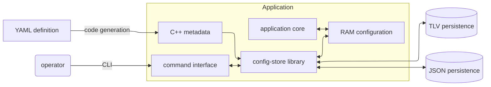
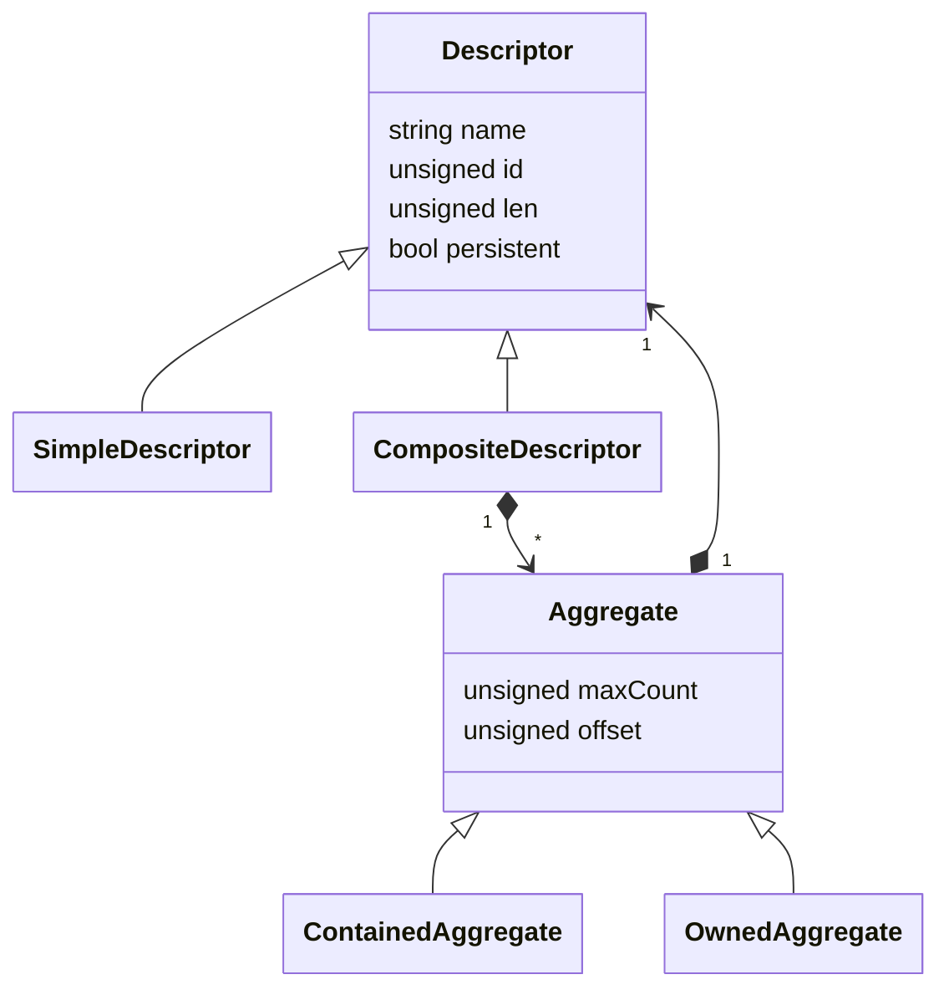

# Introduction

config-store is a small library that allows the user to create a schema for configuration data, typically for an embedded device. The configuration data is kept in RAM, where it serves as configuration settings for the application. This data can be viewed and modified via a text-based Command Line Interface, and stored to and recovered from non-volatile memory. The non-volatile format can be binary TLV, or JSON.

The metadata that describes the data schema can be implemented by the user as hand-written C++ code, or generated automatically by a Python script from a schema written in YAML.



# Description of client application interaction with config-store library
The use of this library has several parts:
1. Define the metadata schema. This can be done in one of two ways:
   - Write the .cpp and .h files that define the metadata, or
   - Write the metadata in YANG format, and use the Python script in directory `code_gen` to auto-generate the .cpp and .h files
2. During application initialisation, pass the metadata descriptor to the config-store library for it to manage.
3. During run-time, modify and print the configuration data in RAM using the config-store's command interface. The configuration can also be saved in TLV or JSON format to non-volatile memory.
4. During run-time, the application uses the configuration data held in RAM.

# Examples included in this project
`example` contains an example application with hand-written metadata in C++. There are two versions, one using TLV non-volatile store, and the other using JSON format.

`code_gen_example` contains an example application with a data schema in a YANG file that's translated to C++. There are two versions, one using TLV non-volatile store, and the other using JSON format.

# Memory use
## Library is small
The example application in directory _example_, which consists of a CLI user interface, the config-store library, and a few metadata descriptor objects, is 69K when compiled for Linux x86-64 target.

## Metadata is designed to be ROMable
The metadata is designed to be resident in ROM on embedded microcontrollers.

# Build and install with CMake

Clone project and enter the project directory. Then configure and build the library:
```sh
git clone ...
cd event_recorder
cmake -S . -B build -DCMAKE_BUILD_TYPE=Release
cmake --build build
```
To install the library: TBD

# Use in CMake project

TBD

# Structure of managed data
This diagram shows the relationships between the principal classes that define the metadata. Application of the _composite_ design pattern allows the creation of hierarchies of arbitrary complexity.

A Descriptor is metadata for an item stored in RAM. A single Descriptor may describe an array of items in RAM; see details below under Contained Aggregate and Owned Aggregate.

A Composite Descriptor contains other Descriptors (either Composite or Simple), each via an Aggregate which describes _how_ it contains the component Descriptor.

A Simple Descriptor describes an item that has a built-in C++ type: integers, chars, bool, and floating-point types.

An Aggregate describes the relationship between a Composite Descriptor and a component Descriptor.

A Contained Aggregate means the component items reside in the same block of memory as the composite to which they belong. The number of component items is fixed, either a single item or a fixed-length array.

A Owned Aggregate means the component items reside in a block of memory that is pointed to by the composite that owns them. The number of component items is variable, between 0 and Aggregate::maxCount.



# Operator command-line interface
The CLI allows an operator to modify and view the configuration in RAM.

A command consists of an optional item-identifier, followed by an optional action.

The actions that apply in the current context are:
- "=" set the value of a simple item.
- "prt" display an item
- "prtc" display the configurable parts only of an item
- "setdef" set an item to its default value.
- "add" add an owned item within the context of its parent item
- "del" delete an owned item within the context of its parent item
- "setdef" return an item to default values
- "?" display help related to current context. This help is very limited.

The actions whose meaning does not depend on the current context:
- "save" save entire configuration to NVRAM
- "load" load entire configuration from NVRAM
- "<" reset current context to top level

The item-identifier part consists of a concatenation of item names and indices.

Entering an item-identifier without a following command just changes the current context.

Referencing an item results in its creation and that of all the owned/optional items that contain it. This makes it possible to replay the output of a prtc command to an empty config to re-create the corresponding configuration. As each "=" action is executed, the necessary parent items are created.

# Thread safety
There is currently no protection against concurrent access to the RAM data by a thread running the config-store library which modifies the RAM data, and a thread running the application core which reads configuration from the RAM data. This means that currently the library is most suitable for devices that are configured before being put into service, and taken out of service while they are re-configured, thus avoiding data races.

# Migrating stored configuration to a new schema
When the application developer changes the data schema, by adding or removing components in Composite Descriptors, data that is already saved in devices in the field can still be loaded and used. The rules to be followed and the limitations are described here. The case where data is saved in the TLV format is described first; rules for the JSON case are similar. We also explain how the code generator works, if the developer is using the option to generate code from a YAML schema definition.

If the developer removes an obsolete component from a Composite, config-store will no longer load the corresponding data from the persistent TLV store.

If the developer adds a component to a Composite, they should assign it a new type ID for use in the TLV store. This type ID should **not** be one that was used for a previously obsoleted component, since this would lead to incorrect loading from TLV store for units in the field still containing TLV data with the obsolete type ID. Software with the new schema can load older TLV stores where the new component is not present: config-store will assign a default value to the new component. The developer can specify default values for Simple components.

For auto-generated code, the code generator creates a YAML file that associates each component with its type ID. This is used when auto-generating code, to ensure the IDs of components is not changed during their lifetime, and new components are assigned new IDs. This file should be kept under version control. Obsolete IDs may be deleted from this file only when it is certain that there is no unit in the field still containing a TLV store created by software using the old schema with the obsolete component.
